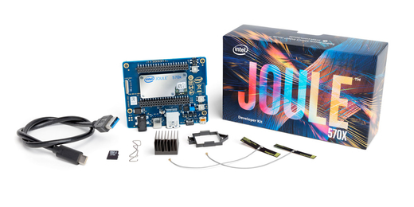

# End-effector Computing

---

# Table of Contents

1.  [Notes for writing:](#org4a85d46)
2.  [What you'll need](#org11f013c)
3.  [Mechanical](#org437c511)
    1.  [Printing the 3D files](#orgf55114f)
    2.  [Mounting the enclosure to the robot arm](#org37ac3e7)
    3.  [Fitting the hardware to the 3D enclosure](#org6f79684)
    4.  [Thermal mitigation](#org3c07fc7)
4.  [Electrical](#org4b2b1a1)
    1.  [Recommended power source](#org7981dc9)
    2.  [Fabricating the cables](#org4e38be8)
    3.  [Connecting the cables](#org54e2305)
    4.  [Cable summary](#orgdba8e15)
5.  [Software](#org84be803)
    1.  [Installing the OS to the Joule](#orgcbfb208)
    2.  [Installing Required Libraries](#org4290339)
    3.  [Installing our Wireless Data Transmission Repo](#org9426616)
6.  [Recommended Networking Configuration](#orgea01b4a)
    1.  [Client-side (off-board computing) Networking](#org06cd64d)
    2.  [Server-side (end-effector computing) Networking](#orgc67814a)
    3.  [ROS](#orge867589)
7.  [Running](#orgdd11d53)

# Notes for writing:

-   We might be able to call this work 'End-effector Computing'
-   The first time you refer to parts like 'buck converter', use number next to the part like:
    -   "Solder the Buck Converter [#6] by to the leads from the DC power Jack [#8]".
    -   These part numbers should be the same as in the "What you'll need" section and in the BOM

# What you'll need

1.  Intel Joule 570X Developer Kit (or comparable board)

2.  Intel RealSense D415 or D435 RGBD Camera (or openni2 support RGBD cameras)

3.  3D Printed Parts 
    > Model and printed object will be shown in [3D File section](#orgf55114f)

    3.1 Intel Joule enclosure body

    3.2 Intel Joule Box Flat enclosure Top

    3.3 Intel Joule Box Incline enclosure Top

    3.4 Mount cuff connector

4.  ....
5.  Optionally, but best for this application Kinova Mico (you could use your own robot and modify the 'cuff mount')

[Here's a detailed Bill of Materials](#orgdr23442) with pricing (as of June 2018) and links to distributors.

# Mechanical

## Printing the 3D files

-   Here is the [3D Print-ready files]() for the Intel Joule housing box and mount with the End-Effector.

Intel Joule enclosure body

Intel Joule Box Flat enclosure Top 

Intel Joule Box Incline enclosure Top 

Mount cuff connector

Assembly

- I used Solidworks designed each part and test the final assembled parts.
- I printed the model with [Ultimaker 2+](https://ultimaker.com/) and [Creator Pro](http://www.flashforge.com/creator-pro-3d-printer/) and settings are listed below:
    - Layer height: 0.1 mm
    - Infill Percentage: 50%
    - Temperature: 225°C

-   Alternatively, Shapeways supplies high quality 3D print services. .....Price is about.....

- The finish model:

Finish Model

## Mounting the enclosure to the robot arm

1. Connect the enclosure body [#3.1] and the end effector cuff connector [#3.4] with 2 X Screw [#]

2. Secure the Intel Joule board [#1] into the enclosure with 4 X Screws [#].

> Please make sure the two wifi antenna would not touch each other and able to be fit in the enclosure.

3. 

## Fitting the hardware to the 3D enclosure

-   Picture of how to insert the Joule into the enclosure
-   Picture of attaching camera

## Thermal mitigation

-   Picture of mounting the cooler

# Electrical

## Recommended power source

-   Mention what the board needs and what the arm provides

## Fabricating the cables

-   Show the steps to build the cable with pictures.

## Connecting the cables

-   Show Kinova side with pictures
-   Show plugging into board

## Cable summary

-   Show picture with Joule and all the things plugged into it

# Software

## Installing the OS to the Joule

## Installing Required Libraries

-   Could provide links to the repos for these libraries, but if there was anything specifically tricky, then outline it here in detail.

## Installing our Wireless Data Transmission Repo

# Recommended Networking Configuration

## Client-side (off-board computing) Networking

-   Show router and configuration page with settings we are using

## Server-side (end-effector computing) Networking

-   Similarly, show how this is configured (if anything special)

## ROS

-   Briefly mention what needs to be set for ROS to be able to see the networked devices correctly

# Running

-   Please refer to the README in the accompanying repo [here] for instructions on running the system.

# Appendix

## Bill of Material
-   Will be a table
-   Must include everything including screws from McMaster, etc.